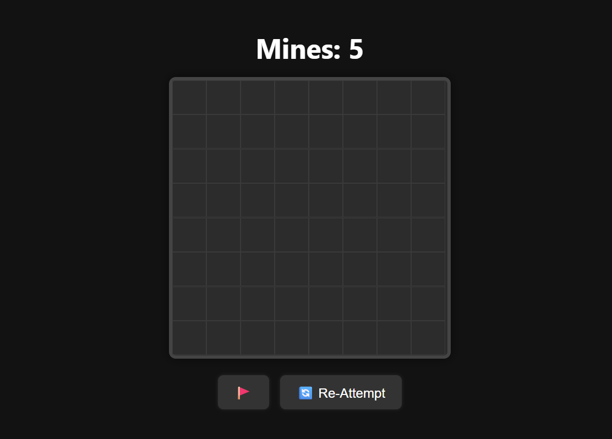

# 🧨 Minesweeper Game

A modern, clean, and fully functional version of the classic **Minesweeper** game built using **HTML, CSS, and JavaScript**.

 <!-- Replace with your actual screenshot filename -->

---

## 🎮 Features

- Classic Minesweeper grid gameplay
- Flagging system for suspected mines 🚩
- Re-attempt (reset) button 🔄
- Clean responsive layout
- Color-coded number tiles
- Fully keyboard/mouse playable
- Dark themed modern UI

---

## 🚀 Getting Started

### ✅ Live Demo

[Click here to play Minesweeper online](https://devrishavd.github.io/minesweeper/)  
*(Replace with your actual GitHub Pages link)*

### 🛠️ Installation

1. Clone the repository:
   ```bash
   git clone https://github.com/your-username/minesweeper.git
   cd minesweeper
